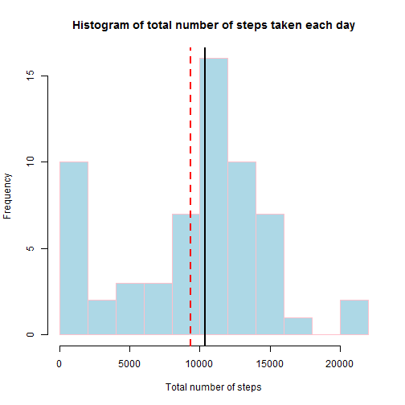
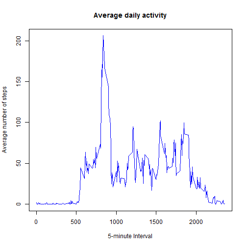
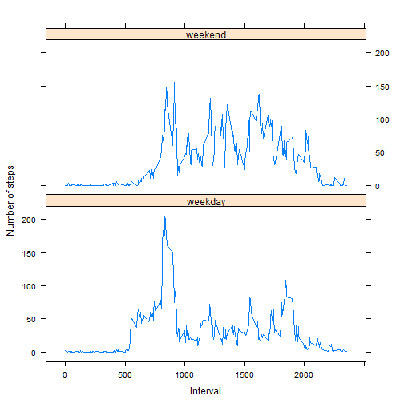

## Loading and preprocessing the data
<br>
The following piece of code first unzips the file and then reads the
`Activity` data. Then it will show the first few rows.


```r
setwd("C:/Users/Isaac/Documents/GitHub/RepData_PeerAssessment1")
unzip("activity.zip")
activity <- read.csv(file       = "activity.csv",
                     colClasses = c('integer', 'Date','integer'))
head(activity)
```

```
##   steps       date interval
## 1    NA 2012-10-01        0
## 2    NA 2012-10-01        5
## 3    NA 2012-10-01       10
## 4    NA 2012-10-01       15
## 5    NA 2012-10-01       20
## 6    NA 2012-10-01       25
```
***


## What is mean total number of steps taken per day?
<br>
We load the `dplyr` package and get use of its chaining rules by invoking 
`%>%` operator.  
<br>
1. Calculate the total number of steps taken per day


```r
library(dplyr, warn.conflicts = F)
Total <- activity %>% group_by(date) %>% 
        summarise(TotalSteps = sum(steps, na.rm = T))
Total
```

```
## Source: local data frame [61 x 2]
## 
##          date TotalSteps
## 1  2012-10-01          0
## 2  2012-10-02        126
## 3  2012-10-03      11352
## 4  2012-10-04      12116
## 5  2012-10-05      13294
## 6  2012-10-06      15420
## 7  2012-10-07      11015
## 8  2012-10-08          0
## 9  2012-10-09      12811
## 10 2012-10-10       9900
## ..        ...        ...
```
The above `Total` data contains total number of steps (column `TotalSteps`) per 
each day (or distinct value of `date`).  
<br>
2. Make a histogram of the total number of steps taken each day


```r
hist(Total$TotalSteps, xlab = "Total number of steps", col = "lightblue", 
     breaks = 12, border = "pink", 
     main = "Histogram of total number of steps taken each day")
abline(v = mean(Total$TotalSteps, na.rm = T), col = 'red', lty = 2, lwd = 2)
abline(v = median(Total$TotalSteps, na.rm = T), col = 'black', lty = 1, lwd = 2)
```

 
<br><br>
3. Calculate and report the mean and median of the total number of steps taken
per day


```r
MeanSteps   <- mean(Total$TotalSteps, na.rm = T)
MedianSteps <- median(Total$TotalSteps, na.rm = T)
```
As can be seen, the mean and median of the total number of steps taken per day are
**9354.2295082** and **10395**, respectively.


***


## What is the average daily activity pattern?
<br>
1. Make a time series plot (i.e., `type = "l"`) of the 5-minute interval (x-axis) 
and the average number of steps taken, averaged across all days (y-axis)


```r
IntervalData <- activity %>% group_by(interval) %>%
                             summarise(MeanStep = mean(steps, na.rm = T))
with(IntervalData,
     plot(interval, MeanStep, type = 'l', col = 'blue',
          main = 'Average daily activity',
          ylab = 'Average number of steps', xlab = '5-minute Interval'))
```

 
<br>
2. Which 5-minute interval, on average across all the days in the dataset,
contains the maximum number of steps?


```r
Ndata <- activity %>% group_by(interval) %>% 
        summarise(MaxStep = max(steps, na.rm = T))
ANS   <- Ndata$interval[which(Ndata$MaxStep == max(Ndata$MaxStep, na.rm = T))]
ANS
```

```
## [1] 615
```
Hence, the **`615`**<sup>th</sup> 5-minute interval has the maximum number of steps.

***


## Imputing missing values
<br>
1. Calculate and report the total number of missing values in the dataset
(i.e. the total number of rows with `NA`'s)  


```r
RowMissing <- sum(is.na(activity$steps))
```
The total number of missing values in the dataset is **`2304`**.
<br><br>
2. Devise a strategy for filling in all of the missing values in the dataset.
<br><br>
We decided to fill in `NA`'s with the **`median`** value for that 5-minute interval.
<br><br>
3. Create a new dataset that is equal to the original dataset but with the
missing data filled in.


```r
if ('Hmisc' %in% row.names(installed.packages()) == F) {
        install.packages('Hmisc')
}
activity.i <- activity %>% group_by(interval) %>%
                           mutate(steps = as.integer(Hmisc::impute(steps)))
```
We use `impute` function in `Hmisc` package to fill , and save the result in
`activity.i` data.
<br><br>
4. Make a histogram of the total number of steps taken each day and Calculate 
and report the **mean** and **median** total number of steps taken per day.
Do these values differ from the estimates from the first part of the assignment? 
What is the impact of imputing missing data on the estimates of the total
daily number of steps?
<br>


```r
IntervalData.i <- activity.i %>% group_by(date) %>%
                          summarise(TotalSteps  = sum(steps, na.rm = T))
        
hist(IntervalData.i$TotalSteps, xlab = "Total number of steps", col = "lightblue", 
     breaks = 12, border = "pink", 
     main = "Histogram of total number of steps taken each day")
abline(v = mean(IntervalData.i$TotalSteps, na.rm = T), col = 'red', lty = 2, lwd = 2)
abline(v = median(IntervalData.i$TotalSteps, na.rm = T), col = 'black', lty = 1, lwd = 2)
```

 


```r
MeanSteps.i   <- mean(IntervalData.i$TotalSteps, na.rm = T)
MedianSteps.i <- median(IntervalData.i$TotalSteps, na.rm = T)
```

Below, we compare if the mean and median statistics are different between origianl
and imputed data.


```r
all.equal(MeanSteps, MeanSteps.i)
```

```
## [1] "Mean relative difference: 0.01599697"
```

```r
all.equal(MedianSteps, MedianSteps.i)
```

```
## [1] TRUE
```

Thus, imputing missing values increases the mean total number of steps taken per
day but does not change the median total number of steps taken per day.


***


## Are there differences in activity patterns between weekdays and weekends?
<br>
1. Create a new factor variable in the dataset with two levels - "weekday" and "weekend" indicating whether a given date is a weekday or weekend day.


```r
if ('car' %in% row.names(installed.packages()) == F) {
        install.packages('car')
}
activity.i$day <- car::recode(var = weekdays(x = activity.i$date, abbreviate = T),
                              "c('Sat','Sun')='weekend';else='weekday'",
                              as.factor.result = T)
levels(activity.i$day)
```

```
## [1] "weekday" "weekend"
```
<br>
2. Make a panel plot containing a time series plot (i.e. `type = "l"`) of the
5-minute interval (x-axis) and the average number of steps taken, averaged across
all weekday days or weekend days (y-axis). See the README file in the GitHub
repository to see an example of what this plot should look like using simulated data.


```r
PanelData <- activity.i %>% group_by(interval, day) %>%
                            summarise(MeanSteps = mean(steps, na.rm = T))

library(lattice)
xyplot(MeanSteps ~ interval | day, data = PanelData, type = 'l',
                                   layout = c(1,2), ylab = 'Number of steps',
                                   xlab = 'Interval')
```

 


